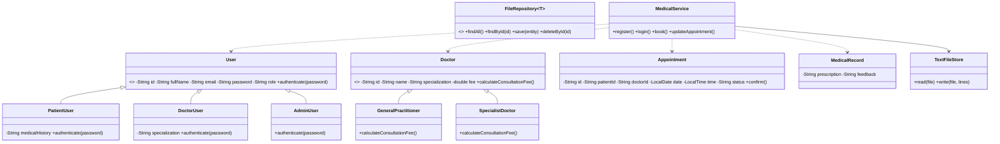

# Class diagram (Mermaid)

```mermaid
classDiagram
class User { <<abstract>> -String id -String fullName -String email -String password -String role +authenticate(password) }
class PatientUser { -String medicalHistory +authenticate(password) }
class DoctorUser { -String specialization +authenticate(password) }
class AdminUser { +authenticate(password) }
User <|-- PatientUser
User <|-- DoctorUser
User <|-- AdminUser
class Doctor { <<abstract>> -String id -String name -String specialization -double fee +calculateConsultationFee() }
class GeneralPractitioner { +calculateConsultationFee() }
class SpecialistDoctor { +calculateConsultationFee() }
Doctor <|-- GeneralPractitioner
Doctor <|-- SpecialistDoctor
class Appointment { -String id -String patientId -String doctorId -LocalDate date -LocalTime time -String status +confirm() }
class MedicalRecord { -String prescription -String feedback }
class FileRepository~T~ { <<interface>> +findAll() +findById(id) +save(entity) +deleteById(id) }
class TextFileStore { +read(file) +write(file, lines) }
class MedicalService { +register() +login() +book() +updateAppointment() }
MedicalService --> TextFileStore
MedicalService ..> User
MedicalService ..> Doctor
MedicalService ..> Appointment
MedicalService ..> MedicalRecord
```
